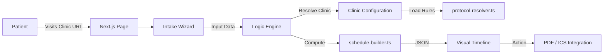

# ShaatHaTipa: Product & Technical Overview

## 1. Product Summary (מה האתר עושה)
**Hebrew:**
המערכת "שעת הטיפה" הינה **מנוע חכם לניהול פרוטוקולים רפואיים** (Protocol Scheduling Engine), המיועדת למטופלים לאחר הליכים רפואיים ולמרפאות המטפלות בהם.
המטרה היא לייצר **לוח טיפולים אישי** המותאם פיזיולוגית למטופל (שעות עירות/שינה) ולפרוטוקול הקליני של המרפאה הספציפית.
**תהליך השימוש:** כניסה דרך קישור מרפאה -> הזנת נתוני טיפול (סוג הליך, תאריך, זמני עירות) -> קבלת לו"ז ויזואלי מדויק -> ייצוא/הדפסה.
הליבה הטכנולוגית היא אגנוסטית לסוג ההליך – היא יודעת לנהל כל סדרה של פעולות/תרופות התלויה בזמן. (דוגמה נוכחית: ניתוחי לייזר בעיניים, אך המערכת תומכת עקרונית בכל תחום רפואי).

**English:**
"ShaatHaTipa" is a **Medical Protocol Scheduling Engine**. It is a white-label ready platform designed to bridge the gap between complex doctor instructions and patient daily life.
Its core purpose is to generate a **personalized treatment schedule** dynamically tailored to the patient's circadian rhythm (wake/sleep cycle) and the specific clinic's medical protocols.
**User Flow:** Clinic Context Entry -> Input Treatment Details -> View Visual Schedule -> Export.
While currently deployed for laser vision correction, the engine is domain-agnostic and supports any post-procedure recovery plan (Orthopedics, Dentistry, Dermatology, etc.) requiring time-sensitive adherence.

---

## 2. Feature List (יכולות מרכזיות)
*   **Protocol Engine (מנוע הפרוטוקולים):**
    *   **Dynamic Scheduling:** Distributes medical actions (meds, exercises, checks) based on patient wake windows.
    *   **Conflict Resolution:** Algorithms to prevent timing overlaps between different medications/actions.
    *   **Chronobiology Aware:** Handles schedules crossing midnight or irregular sleep patterns.
    *   **Smart Rounding:** Snaps times to user-friendly increments (e.g., nearest 30 mins) without breaking medical rules.
*   **Clinic-Centric UI (ממשק מותאם מרפאה):**
    *   **White-Label Capabilities:** Each clinic gets a dedicated context/route.
    *   **Wizard-based Flow:** Simplifies complex medical intake into friendly steps.
    *   **Responsive Timeline:** Visual adherence guide optimized for mobile recovery usage.
*   **Export & Adherence (ייצוא ומעקב):**
    *   **PDF Generation:** Prints a clear "Refrigerator Sheet" for offline usage.
    *   **Active Calendar Integration (ICS):** Injects protocol directly into the patient's digital life with reminders.
*   **Safety & Validation (בטיחות):**
    *   **Impossible Schedule Detection:** Blocks inputs where safe adherence is mathematically impossible.
    *   **Rule-Based Validation:** Ensures strictly logical time inputs (Wake != Sleep).
*   **Localization (לוקליזציה):**
    *   Native support for RTL (Hebrew) and LTR (English) interfaces.

---

## 3. Architecture Overview (ארכיטקטורה)
**Hebrew:**
הארכיטקטורה בנויה כמערכת **Stateless & Scalable**. אין הדוק של לוגיקה למרפאה אחת.
המנוע (Logic Engine) מקבל "חוקים" (Configuration) ו-"אילוצי מטופל" (Input) ומחזיר "תוכנית" (Schedule).
**זרימת מידע:** הדפדפן (Clinic Page) -> שולח בקשה -> מנוע הלוגיקה טוען את פרוטוקול המרפאה -> מחשב אופטימיזציה -> מחזיר JSON ללקוח.

**English:**
Built on Next.js 14/16 (App Router) with a **Stateless, Config-Driven Architecture**.
The system acts as a pure function: `f(ClinicRules, PatientData) => TreatmentSchedule`.
**Flow:**
`[Patient Browser]` -> `POST /api/generate-schedule` -> `[Protocol Resolver]` (Loads Clinic Config) -> `[Schedule Builder]` (Applies Logic) -> `[Response]`.
There is no hardcoded limitation to "eye drops"; the `medications` array can represent any time-based medical action.

---

## 4. Clinic-First Architecture (ארכיטקטורת ריבוי מרפאות)
**Hebrew:**
המערכת תוכננה מיומה הראשון לתמוך ב-SaaS (תוכנה כשירות) למרפאות מרובות.
*   **בידוד מלא:** כל מרפאה מוגדרת בקובץ קונפיגורציה נפרד (`config/clinics.ts`).
*   **פרוטוקולים נפרדים:** מרפאה א' יכולה לתת "דקסמיצין" 4 פעמים ביום, ומרפאה ב' 3 פעמים ביום. המנוע לא "מקודד קשיח" את הטיפול אלא קורא אותו מההגדרות.
*   **יתרון משפטי/בטיחותי:** האחריות הרפואית היא על הפרוטוקול של המרפאה. המערכת היא הצינור הטכנולוגי שמנגיש אותו.
*   **Scaling:** הוספת מרפאת שיניים או אורתופדיה דורשת רק הוספת קובץ קונפיגורציה, ללא שינוי בקוד המנוע.

**English:**
The system is architected as a **Multi-Tenant Protocol Platform**.
*   **Isolation strategy:** Clinics are defined in isolated configuration files/objects.
*   **Decoupled Logic:** The `schedule-builder` doesn't know *what* the medicine is, only *how* it should be distributed (frequency, spacing, duration).
*   **Scalability:** Onboarding a new medical vertical (e.g., Dental Implants) requires strictly **configuration changes**, not engine code rewrites.
*   **Liability Boundary:** The system strictly enforces the *Clinic's* specific protocol, ensuring medical governance remains with the provider.

---

## 5. Repository Map (מפת קוד)

| Location | Responsibility | Key Files / Functions |
| :--- | :--- | :--- |
| `app/[locale]/` | Clinic-Aware Routing | `page.tsx` (Reads `?clinic=` param) |
| `config/` | **Clinic Registry** | `clinics.ts` (Defines Brands & Rules) |
| `lib/domain/` | **The Engine** | `schedule-builder.ts` (Generic Scheduler), `protocol-resolver.ts` |
| `components/` | UI Layer (White-label ready) | `SurgeryForm.tsx` (Intake), `ScheduleView.tsx` (Display) |
| `lib/utils/` | Export Adapters | `pdf.ts` (Print Engine), `ics.ts` (Calendar Engine) |
| `prisma/` | Analytics | `schema.prisma` (Usage metrics only) |

---

## 6. Scheduling Logic Explanation (האלגוריתם)
**Hebrew:**
האלגוריתם (`buildProtocolSchedule` - formerly `buildLaserSchedule`) הוא למעשה **Total Time Distribution Utility**.
1.  **נירמול זמן:** המרת "יממה" לערמכים רציפים (בגלל מעבר חצות).
2.  **חישוב צפיפות:** בדיקה מתמטית האם ניתן פיזית לבצע את ההנחיות בחלון הזמן הנתון.
3.  **פיזור אופטימלי:** חלוקת הטיפולים על פני היום במרווחים שווים (Equidistant).
4.  **פתרון התנגשויות (Generic Collision Solver):** אם שני אירועים מתנגשים, המנוע מפעיל היוריסטיקה (Heuristic shift) להזזת אירועים עד למציאת סלוט פנוי, תוך שמירה על חוקי ה-Awake Window.

**English:**
The core logic is a generic **Constraint Satisfaction Solver** for time.
1.  **Time Normalization:** Handling linear time across day boundaries (Next-day sleep).
2.  **Feasibility Check:** Validates input density against available time (Capacity planning).
3.  **Distribution Strategy:** Equidistant placement of actions within the active window.
4.  **Collision Resolution:** A generic iterative solver that shifts conflicting events by `±15m` increments until a valid conflict-free slot is found. It knows nothing of "drops," only of "time slots" and "overlapping conflicts."

### Procedure Date Selection – Intentional Behavior

**Status:** Supported & Intentional  
**Context:** Scheduling logic / User Input

The system is explicitly designed to accept **past dates** for the procedure selection. This logic is critical for the "Ongoing Recovery" use case and is **not a bug**.

**Rationale:**
1.  **Long-Tail Protocols:** Medical recovery protocols (e.g., PRK, Corneal Transplant) often span months. A patient may access the application on "Day 30" of their recovery.
2.  **Relative Calculation:** The core engine calculates all events relative to the **Original Procedure Date**. To generate an accurate schedule for "Today" (e.g., Day 30), the engine *requires* the true historical date of the surgery.
3.  **Active Utility:** Selecting a past date is not for historical logging. It is necessary to correctly project the *currently active* and *future* medication drops based on the protocol's timeline.

**Implication:**
Validators should **not** block or warn against past dates. The UI must allow users to select their actual surgery date, even if it was 3 months ago, to ensure the generated schedule aligns with their biological recovery timeline.

---

## 7. Export System (PDF / ICS)
**Hebrew:**
מערכת הייצוא מתרגמת את הלו"ז המופשט לפורמטים צרכניים.
*   **PDF:** מייצר דף הוראות ("Refrigirator Page") נקי, מודפס דרך הדפדפן.
*   **ICS:** ממיר את האובייקטים הגנריים לסטנדרט `iCalendar` עולמי, כולל התראות התעוררות (`VALARM`) לפני כל פעולה.

**English:**
Translates abstract schedule objects into patient-accessible formats.
*   **PDF:** Generates a clean, print-ready HTML view for physical adherence capabilities.
*   **ICS:** Converts generic schedule items into standard `VEVENT` objects compatible with Google Calendar, Apple Calendar, and Outlook, injecting automated adherence reminders.

---

## 8. Data & Privacy (Security)
**Hebrew:**
*   **Privacy-First Architecture:** המערכת לא שומרת מידע רפואי (PHI/PII) בשרת.
*   **Client-Side State:** כל הנתונים הרגישים (תאריכים/תרופות) חיים ומתים ב-Session של הדפדפן.
*   **Stateless Backend:** השרת מבצע חישוב ושוכח את המידע מיד.
*   **Compliance Ready:** הארכיטקטורה תומכת בעקרונות GDPR/HIPAA מעצם היותה "לא שומרת מידע".

**English:**
*   **Zero-Knowledge Storage:** The server does not persist patient names, dates, or generated schedules.
*   **Ephemeral processing:** Inputs are processed in-memory and discarded.
*   **Compliance Alignment:** Reduces HIPAA/GDPR scope significantly by removing the database of record for patient data.

---

## 9. Top Improvement Opportunities (Platform Level)

| Area | Impact | Effort | Description |
| :--- | :--- | :--- | :--- |
| **Scale** | High | M | **Self-Service Config:** Allow clinics to upload/edit their JSON protocols via Admin UI (CMS). |
| **Adherence** | High | M | **Push Notifications:** PWA integration for real-time mobile push instead of just passive Calendar ICS. |
| **Reliability** | High | M | **Constraint Testing:** Unit tests for edge-case sleep patterns (shift workers, 4h sleep windows). |
| **UX** | Medium | S | **Vertical Timeline:** optimize the visual display for long vertically scrolling action lists (Mobile-first). |
| **Audit** | Medium | S | **Disclaimer Versioning:** Bind specific TnS versions to specific clinics/exports for legal safety. |
| **Integration** | Medium | L | **EHR Deeplinking:** Allow clinics to pre-fill the wizard via URL params generated from their CRM. |
| **Performance** | Low | S | **Tree Shaking:** Ensure unused clinic configs don't bloat the client bundle. |
| **Accessibility** | Medium | M | **Voice Output:** "Read my schedule" feature for visually impaired post-op patients. |
| **Branding** | High | M | **Advanced White-labeling:** Support CSS Variables injection per clinic for full color-theme matching. |
